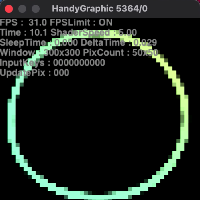

<!--

GitHub上で見る場合
https://github.com/NidoKota/HGShader/blob/main/HGKNOWLEDGE.md

-->

# HandyGraphicの知見
これからHandyGraphic触る人のためにも、今回の開発で工夫した、苦労した話を書いておこうと思います<br>

# C++でHandyGraphicを使う
HandyGraphicをC++で使用するには、いくつかの手順が必要です<br>
まず、includeについてですが<br>

```C++
extern "C" { 
    #include <handy.h>
}
```
と記述する必要があります<br>
これで正常にHandyGraphicの関数を呼ぶことができます<br>
<br>
またコンパイルにも注意が必要で、g++でコンパイルする場合<br>
`g++ Main.cpp -o Main -lhg`<br>
と書く必要があります<br>
<br>
(恐らくhgccはgccのコンパイルのコードに`-lhg`を付けているのだと思われます)

# とにかく描画しない &nbsp;
HandyGraphicで一番処理を食われるのは描画です<br>
HGShaderではなるべく描画をしないよう工夫しました<br>
<br>
<br>
前回の描画を利用する機能を消した状態<br>
UpdatePixが2500個(全部)で、3.3FPSとガクガクの状態になってます<br>&nbsp;<br>

<br>
デフォルトの状態<br>
同じ解像度で同じシェーダーなのにUpdatePixが300個程度になっています<br>
FPS数も31.0と大幅に向上しています<br>
<br>
レイヤーの内容を削除しないことで、前回のレンダリング結果は画面上に保持されます<br>
これを利用しない手はありません<br>
<br>
この小技は、今回の`HgBox`を大量に描画する手法でなくても使えると思います<br>
例えば、敵やプレイヤーが動いていない時は、同じオブジェクトをレンダリングせずに、前回の描画結果をそのまま使う事で処理時間を短縮できます<br>
<br>
ちなみにdoubleLayerでも `HgLCopy`関数でこの小技を使うことができます<br>
(`EventHandlers/ShaderDisplayer.cpp`を参照して下さい)<br>
<br>
また、解像度を下げるのも有効です<br>
解像度を下げると描画するピクセルの数が減るので、FPS数の増加に繋がります<br>
しかし、解像度が下がると当然見た目が不鮮明になってしまうデメリットがあります<br>

# 色数を減らす
上の項目の続きですが、描画を減らすために色数を減らす設定項目を作りました<br>
それが `Library/Defines.hpp` の `COLOR_CONT`です<br>
<br>
この`COLOR_CONT`を減らすと、描画する色数が制限されます<br>
つまり、ピクセルを描画する際、前フレームと同じ色になる可能性が上がり、ピクセル(`HgBox`)の描画回数が減るというわけです

<br>
通常ではUpdatePixが吹っ切れて、FPS数は4.5となっています<br>
<br>
<br>
10色に制限するとUpdatePixが大幅に減り、FPS数が10.1に上がっています<br>
<br>
ただし、以下の代償があるので使用には注意が必要です<br>
- 縞々のアーティファクト(マッハバンド)が出現する
- 色数を減らすのに少々の処理時間が必要になる

なお、`COLOR_CONT`を 256 (デフォルト)に設定している場合は何も処理しません<br>
(この色数を減らす処理は`ShaderDisplayer.cpp`内にあります)<br>

# スレッドを分ける
恐らくHandyGraphicの関数を複数スレッドで同時に使う事はできません(実行するとフリーズします)<br>
ですから今回は、シェーダーの計算のみスレッドを分けました<br>

<br>

上の図を見てください<br>
`ShaderDisplayer`では、全ての色を保管した3つの配列を持っています<br>
<br>
左から、以下の情報が格納されます<br>
- シェーダーからの出力を入れる配列<br>
- レンダリングする内容が入った配列<br>
- 前回レンダリングした内容が入った配列<br>

この配列の内容は、1フレームごとに右にずれていきます<br>
<br>
流れを説明すると、<br>
まずUpdateColorsにシェーダーの計算結果を入れます<br>
それと同時に、前回UpdateColorsにあった内容(RenderColors)と<br>
そのまた前回にUpdateColorsにあった内容(BufferColors)の差分を`HGBoxFill`関数でレンダリングします<br>
<br>
こうする事で、スレッドを分けつつ前回の描画結果を使ったレンダリングができるのです<br>
シェーダーの計算とレンダリングを同時に行うので、動作が改善します<br>
~~(ただし、メモリを大量消費する癖に、3~5FPS向上する程度の効果しかありませんが)~~<br>
※よって効果があるかは非常に怪しい<br>

# HgSleepの時間を状況によって変更する
`HgSleep`関数でThreadを止め、アニメーションすることは重要です<br>
<br>
内容が少々重たいなら必要ないかもしれませんが<br>
もし偶然に何もない画面をレンダリングすれば、無駄なフレームが大量に生成されることになります<br>
HgShaderも開発段階で、5000FPSになったことがありました<br>
<br>
流石にそれは許容できないので、レンダリングにかかった時間を考慮してThreadを止めようという話になります<br>
それにはミリ秒まで正確に計測できる関数が必要になります<br>
<br>
HGShaderでは、`std::chrono::system_clock`を使用しました<br>
これで、起動からの経過時間と、1フレームの計算にかかった時間(deltaTime)を導き出せます<br>
<br>
そして、`Library/Defines.hpp` の `TARGET_FPS`が実現した場合のdeltaTimeと<br>
現在のdeltaTimeを比較し、Threadを止める時間を決めているわけです<br>
(これらの処理は`Main.cpp`内にあります)<br>
<br>
(21/4/3 解決)<br>
~~しかしこの比較の仕方が適当なので、FPS数が`TARGET_FPS`を大幅に超えることがあります<br>
前のdeltaTimeと今のdeltaTimeで微分して、次の状態を予測する必要があると考えています<br>~~

# キー入力周りの機能を改善する
`HgEventNonBlocking`関数などで受け取れるキー入力の情報は、入力されているか、離されているか の2種類です<br>
これでは少し不便なので、多くの場合は前の入力と比較してキーが入力された瞬間を取得するわけですが<br>
これだと 1つのキーに対して何個か変数を用意しなくてはなりません<br>
<br>
そこで今回は、`EventHandlers/InputManager.cpp`を開発しました<br>
インスタンス化時に、これから使用するキーをあらかじめ登録する必要がありますが<br>
あとは関数を呼ぶだけでキー入力した瞬間や、離した瞬間を取得できます
~~(まるでUnityのGetDownやGetUpのよう)~~<br>
キー情報の取得も`std::map`の要素にアクセスしてビット演算するぐらいなので、軽いはずです<br>
<br>
とても便利だったので、機会があれば是非使ってみてください<br>
頑張ればC言語でも同じような機能を作れるかも...<br>
(これら処理は`InputManager.cpp`内にあります)<br>


