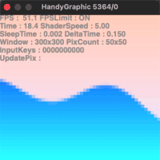
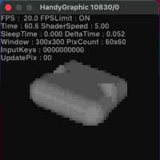
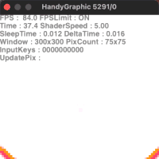
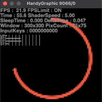

<!--

GitHub上で見る場合
https://github.com/NidoKota/HGShader/blob/main/README.md

-->

# HGShader

  
 

<a href="http://www7a.biglobe.ne.jp/~ogihara/Hg/hg-jpn.html" target="_blank" rel="noopener noreferrer">HandyGraphic</a> で本格的なシェーディングがしたい…！ 
自分のピクセルシェーダーをC++に移植してデバッグしたい…！ 
HGShaderはそんなニッチで意味不明な需要を満たすプログラムです 

# 動作原理
毎フレーム画面上に大量の四角い図形を並べています 
初期状態の50x50ピクセルで2500個のHgBoxFillが表示されます 
FPS数(FramePerSecond)を稼ぐためにいくつかの軽量化も行っています 

# 紹介動画
https://user-images.githubusercontent.com/36328961/125702413-61206a6e-7483-4179-ba0f-f18752d57c3d.mp4

# サンプルの起動方法
サンプルをコンパイル後、HandyGraphicを起動させた状態で、実行ファイル(`build/app`)を実行します 

# サンプルのコンパイル方法
Makefileを導入した状態で`make`を実行します 
なお、スマホ接続時のJson解析に<a href="https://rapidjson.org/" target="_blank" rel="noopener noreferrer">RapidJson</a>を使用しているので、その導入が必要です

# 操作方法
基本の操作 
- 上下の方向キー : 解像度を上げ下げする 
- 左右の方向キー : 別のシェーダーに切り替える 
- スペースキー : 情報の表示/非表示を切り替える 

その他の操作 
- カンマキー( , ) : 再生速度を上げる 
- ドットキー( . ) : 再生速度を下げる 
- r キー : 時間をリセットする 
- f キー : FPS数制限を設定/解除する 
- q キー : HandyGraphicを終了する 

# スマホを接続する

https://user-images.githubusercontent.com/36328961/142802126-4341ac6e-0e66-4996-9616-4cb359e3e5e6.mp4

<a href="https://zig-project.com/" target="_blank" rel="noopener noreferrer">ZIGSIM</a>(無料版でも可)を使用し、スマホと接続することができます 
接続すると、センサー情報を使用してシェーダーを動かすことができるようになります 
サンプルでは`PhoneShader`のみ対応しています 
このシェーダーではスマホの回転情報を受け取り、オブジェクトを回転させます 

# 表示される情報
 
- FPS : FPS数 
- FPSLimit : FPS数制限を設定しているかどうか 
- Time : 起動してからの経過時間 
- ShaderSpeed : シェーダーの再生速度 
- SleepTime : 余計なフレームを生成しないためにThreadを止めた時間 
- DeltaTime : 1フレーム生成するのにかかった時間 
- Window : 現在のWindowSize 
- PixCount : 現在表示されているピクセルの数 
- InputKeys : 入力のビットフラグ 
- グラフ :  
&nbsp;UP : シェーダーの計算時間 
&nbsp;RT : ピクセルのレンダリング時間 
&nbsp;DT : DeltaTime 
&nbsp;ST : SleepTime 
&nbsp;(目盛りは10ms) 

# サンプルにシェーダーを追加する
`Main.cpp` 内のShaderDisplayerの引数にシェーダーを登録すると表示されるようになります 
登録できるピクセルシェーダーは、 
引数にUV座標と経過時間を取り、返り値でそのピクセルの色を返す`vec3(*)(vec3, float)`型の関数のみです 
なお、シェーダーはGLSLと似た形式で書くことができます 

# シェーダーを書く際の注意点

## 前フレームとの差分を減らす
少しでも処理を軽くするために、色を更新する領域が多いシェーダーは避けてください 
前フレームのピクセルと同じ色であれば、HGShaderはそのピクセルの描画をスキップし、レンダリングを早めます 
また、`Library/Defines.hpp` の `COLOR_CONT`を下げ、表示する色数を減らす検討もしてください

## 低解像度でも楽しめるシェーダーにする
低解像度であれば、ほとんどのシェーダーは安定して動作します 
様々な環境で動作させるために、低解像度でも楽しめるシェーダーを書くことが重要です

## 数字の後に f を付ける
C++では小数点を含む数字はdoubleに解釈されるのでtemplate関数でエラーが発生します 
数字の後の f を癖付けてください 

## 名称が異なる関数がある
GLSLのatan関数は、math.hのatan関数(挙動が異なる)と名前が被っているのでatan2関数として実装しています 
また、GLSLのnot関数は、C++のnotキーワードと名前が被っているので_not関数として実装しています 

# その他のコードの説明
<a href="CODEMANUAL.md" target="_blank" rel="noopener noreferrer">CODEMANUAL</a> をご覧ください 

# HandyGraphicの知見
<a href="HGKNOWLEDGE.md" target="_blank" rel="noopener noreferrer">HGKNOWLEDGE</a> をご覧ください 

# 感想
半年前の3Dの図形描画より滑らかになって楽しかった 
この形式で初期のウィザードリィとかDoomとか移植できそう 
けどもう絶対にやらない 
~~後輩の方に任せます~~ 

# 権利者表示
疑似乱数に関して 
W.J.J. Rey, 22nd European Meeting of Statisticians and the 7th Vilnius Conference on Probability Theory and Mathematical Statistics, August 1998 

グラデーションノイズに関して 
Inigo Quilez - iq/2013 
<a href="https://www.shadertoy.com/view/XdXGW8" target="_blank" rel="noopener noreferrer">https://www.shadertoy.com/view/XdXGW8</a> 

# ライセンス
<a href="LICENSE" target="_blank" rel="noopener noreferrer">MIT License</a> 
何か変更したい点などあればご連絡ください
